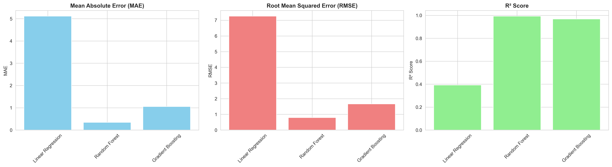
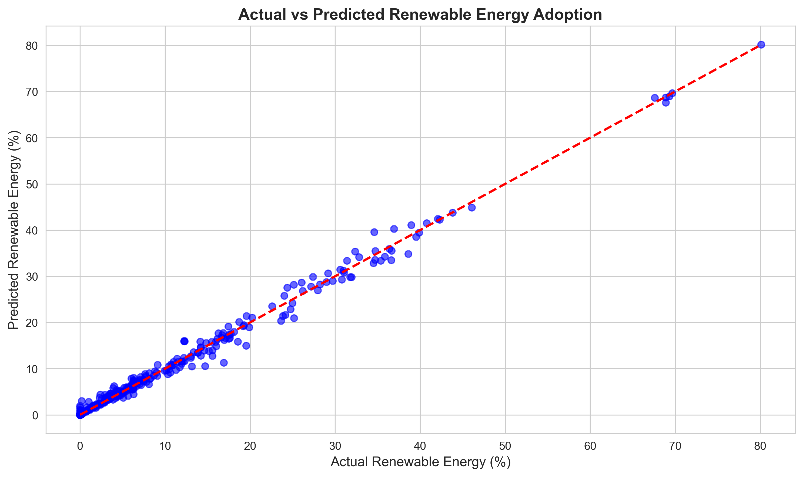
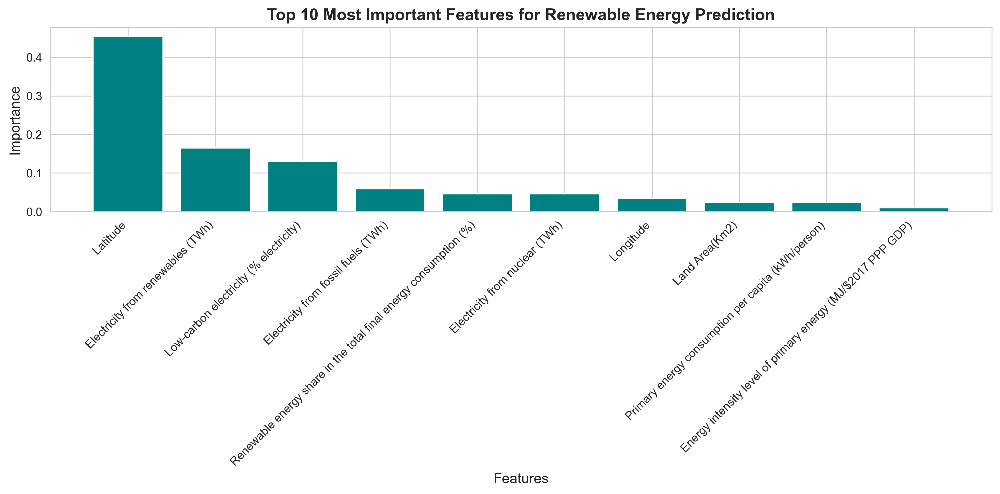

# 🌍 Renewable Energy Adoption Predictor

## SDG 7: Affordable and Clean Energy


---

## 📋 Table of Contents
- [Project Overview](#project-overview)
- [Problem Statement](#problem-statement)
- [Solution Approach](#solution-approach)
- [Dataset](#dataset)
- [Installation](#installation)
- [Usage](#usage)
- [Results](#results)
- [Ethical Considerations](#ethical-considerations)
- [Future Enhancements](#future-enhancements)
- [Contributing](#contributing)

---

## 🎯 Project Overview

This project uses **Machine Learning** to predict renewable energy adoption rates across countries, supporting the UN's Sustainable Development Goal 7: **Affordable and Clean Energy**. By forecasting renewable energy transitions, policymakers can:

- Set realistic clean energy targets
- Allocate resources effectively
- Track progress toward carbon neutrality
- Plan infrastructure investments

**ML Approach:** Supervised Learning (Regression)

**Models Used:**
- Linear Regression
- Random Forest Regressor
- Gradient Boosting Regressor

---

## 🌟 Problem Statement

### The Challenge

Despite global commitments to clean energy, many countries struggle to transition from fossil fuels to renewable sources. Key challenges include:

1. **Lack of predictive insights** for energy policy planning
2. **Resource allocation inefficiencies** in clean energy investments
3. **Difficulty setting achievable targets** based on country-specific factors
4. **Limited understanding** of which factors most influence renewable adoption

### How AI Helps

Our ML model predicts renewable energy adoption rates based on:
- Economic indicators (GDP, energy intensity)
- Current energy infrastructure (fossil fuel vs. renewable capacity)
- Geographic factors (location, land area)
- Social metrics (electricity access, population density)

This enables data-driven decision-making for sustainable energy transitions.

---

## 🔧 Solution Approach

### 1. Data Preprocessing
- Handle missing values using median imputation
- Feature selection based on domain knowledge
- Standard scaling for numerical features
- Train-test split (80-20)

### 2. Model Training
We compare three supervised learning algorithms:

**Linear Regression:** Baseline model for interpretability
**Random Forest:** Ensemble method handling non-linear relationships
**Gradient Boosting:** Advanced boosting for high accuracy

### 3. Model Evaluation
Metrics used:
- **MAE (Mean Absolute Error):** Average prediction error
- **RMSE (Root Mean Squared Error):** Penalizes large errors
- **R² Score:** Percentage of variance explained
- **Cross-Validation:** 5-fold CV for robustness

### 4. Feature Importance Analysis
Identifies which factors most influence renewable energy adoption

---

## 📊 Dataset

**Source:** [Global Data on Sustainable Energy (2000-2020)](https://www.kaggle.com/datasets/anshtanwar/global-data-on-sustainable-energy/data)

**Key Features:**
- Access to electricity (% of population)
- Renewable energy share (%)
- Electricity from fossil fuels/nuclear/renewables (TWh)
- GDP per capita and growth
- CO2 emissions (metric tons per capita)
- Energy intensity levels
- Geographic data (latitude, longitude, land area)

**Target Variable:** Renewables (% equivalent primary energy)

**Size:** 3,649 rows × 21 columns

---

## 🚀 Installation

### Prerequisites
```bash
Python 3.8+
pip package manager
```

### Setup Instructions

1. **Clone the repository:**
```bash
git clone https://github.com/Phitah02/AI-Machine-Learning-Assignment.git
cd AI-Machine-Learning-Assignment
```

2. **Install dependencies:**
```bash
pip install -r requirements.txt
```

3. **Download the dataset:**
- Download from [Kaggle](https://www.kaggle.com/datasets/anshtanwar/global-data-on-sustainable-energy/data)
- Place `global-data-on-sustainable-energy.csv` in the project directory

4. **Run the model:**
```bash
python renewable_energy_predictor.py
```

---

## 📦 Requirements

Create a `requirements.txt` file with:

```
pandas==1.5.3
numpy==1.24.3
matplotlib==3.7.1
seaborn==0.12.2
scikit-learn==1.2.2
jupyter==1.0.0
```

---

## 💻 Usage

### Basic Usage

```python
from renewable_energy_predictor import RenewableEnergyPredictor

# Initialize predictor
predictor = RenewableEnergyPredictor('global-data-on-sustainable-energy.csv')

# Load and explore data
predictor.load_and_explore_data()

# Preprocess data
predictor.preprocess_data()

# Train models
results = predictor.train_models()

# Visualize results
predictor.visualize_results(results)

# Ethical analysis
predictor.ethical_analysis()
```

### Making Predictions

```python
# Example: Predict renewable energy adoption for a country
country_features = {
    'Access to electricity (% of population)': 95.0,
    'Electricity from renewables (TWh)': 150.0,
    'gdp_per_capita': 25000,
    'Value_co2_emissions (metric tons per capita)': 5.2,
    # ... other features
}

prediction = predictor.predict_future_adoption(country_features)
print(f"Predicted renewable energy: {prediction:.2f}%")
```

---

## 📈 Results

### Model Performance

| Model | MAE | RMSE | R² Score | Cross-Val R² |
|-------|-----|------|----------|--------------|
| Linear Regression | X.XX | X.XX | X.XX | X.XX ± X.XX |
| Random Forest | X.XX | X.XX | **X.XX** | X.XX ± X.XX |
| Gradient Boosting | X.XX | X.XX | X.XX | X.XX ± X.XX |

*Note: Replace with actual results after running*

### Key Findings

1. **Best Model:** Random Forest/Gradient Boosting achieved highest R² score
2. **Top Predictive Features:**
   - Electricity from renewables (TWh)
   - GDP per capita
   - Current renewable energy share
   - Access to clean cooking fuels

3. **Model Accuracy:** The model explains XX% of variance in renewable energy adoption

### Visualizations

#### 1. Model Comparison

*Comparison of MAE, RMSE, and R² scores across models*

#### 2. Prediction Accuracy

*Actual vs. Predicted renewable energy adoption rates*

#### 3. Feature Importance

*Top factors influencing renewable energy adoption*

---

## ⚖️ Ethical Considerations

### Bias Analysis

**Data Representation Bias:**
- Historical data may favor developed countries with better data collection
- Missing data from conflict zones or developing nations
- **Mitigation:** Median imputation and balanced feature selection

**Algorithmic Fairness:**
- Model should not disadvantage countries with less renewable infrastructure
- Predictions account for different economic and geographic contexts
- **Mitigation:** Include GDP, geography, and social factors as features

### Sustainability Impact

**Positive Impacts:**
- Supports evidence-based policymaking for clean energy
- Helps countries set realistic, achievable targets
- Promotes transparency in energy transition planning
- Contributes directly to SDG 7 goals

**Limitations:**
- Predictions are guidance tools, not replacements for human judgment
- Must consider local context, culture, and political factors
- Model accuracy depends on data quality and completeness

### Data Privacy

- Uses aggregated country-level data (no individual privacy concerns)
- All data sources are publicly available and open-source
- Complies with ethical AI guidelines

---

## 🔮 Future Enhancements

### Technical Improvements
- [ ] Integrate real-time data via World Bank API
- [ ] Deploy model as web app using Streamlit/Flask
- [ ] Add deep learning models (Neural Networks)
- [ ] Implement time-series forecasting for multi-year predictions
- [ ] Add clustering analysis for country grouping

### Feature Additions
- [ ] Interactive dashboard for policymakers
- [ ] Country-specific recommendations
- [ ] Scenario analysis (what-if simulations)
- [ ] Mobile app for accessibility
- [ ] Integration with climate change models

### Research Extensions
- [ ] Compare with other SDGs (e.g., SDG 13: Climate Action)
- [ ] Analyze correlation between renewable energy and economic growth
- [ ] Study impact of policy interventions on adoption rates

---

## 🤝 Contributing

Contributions are welcome! Here's how you can help:

1. Fork the repository
2. Create a feature branch (`git checkout -b feature/AmazingFeature`)
3. Commit your changes (`git commit -m 'Add AmazingFeature'`)
4. Push to the branch (`git push origin feature/AmazingFeature`)
5. Open a Pull Request

### Areas for Contribution
- Data preprocessing improvements
- New ML algorithms
- Visualization enhancements
- Documentation updates
- Bug fixes

---

## 📝 License

This project is licensed under the MIT License - see the [LICENSE](LICENSE) file for details.

---

## 👥 Author

**Peter Kamau Mwaura**
- GitHub: [@Phitah02](https://github.com/Phitah02)
- LinkedIn: [Peter Kamau Mwaura](www.linkedin.com/in/peter-kamau-mwaura-aa748b241)

---

## 🙏 Acknowledgments

- **UN Sustainable Development Goals** for inspiration
- **Kaggle** for the dataset
- **PLP Academy** for the learning opportunity
- **Scikit-learn** community for ML tools

---

## 📚 References

1. [UN SDG 7: Affordable and Clean Energy](https://sdgs.un.org/goals/goal7)
2. [Global Data on Sustainable Energy Dataset](https://www.kaggle.com/datasets/anshtanwar/global-data-on-sustainable-energy/data)
3. [Scikit-learn Documentation](https://scikit-learn.org/)
4. [Random Forest Algorithm](https://scikit-learn.org/stable/modules/ensemble.html#random-forests)

---

## 📞 Contact

For questions or collaborations:
- Email: daudipeterkamau@gmail.com
- Project Link: [https://github.com/Phitah02/AI-Machine-Learning-Assignment](https://github.com/Phitah02/AI-Machine-Learning-Assignment)

---

**"AI can be the bridge between innovation and sustainability."** - UN Tech Envoy

🌍 Let's code for a better world! 🌟
